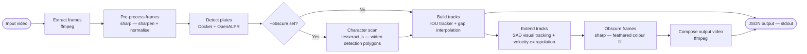

# number-jam

Detect, track, and optionally obscure vehicle number plates in video files.

---

## Overview



| Step | What it does |
|---|---|
| **Extract frames** | Pulls every frame from the video as a JPEG using ffmpeg |
| **Pre-process** | Sharpens and normalises each frame; upscales if the source is narrower than 1280 px |
| **Detect plates** | Sends each frame to OpenALPR (running in Docker) and collects bounding-box polygons and plate text |
| **Character scan** | *(Obscuring only)* Runs tesseract.js on an expanded region around each ANPR detection to find characters that OpenALPR clipped from the polygon edges; widens the polygon to cover them |
| **Build tracks** | Links detections across frames using IOU matching; interpolates positions across short gaps |
| **Extend tracks** | Extends each track beyond the ANPR detection window using SAD[^sad] template matching (backward and forward), then velocity extrapolation for `--extend-detection` ms further |
| **Obscure frames** | Fills each detection polygon with a feathered colour sampled from the plate background |
| **Compose video** | Re-encodes the obscured frames into an output video with original audio |
| **JSON output** | Writes a structured result document to stdout |

[^sad]: **Sum of Absolute Differences.** This is a comparison between a block of pixels in the 'current' frame and a candidate block in a candidate frame. Using multiple candidate positions, the lowest SAD is the best match for the original block - so likely indicating the motion of the block.

---

## Usage

### Setup

**macOS:**
```bash
brew install --cask docker-desktop
docker build -t number-jam-alpr docker/
npm install
npm run build
```

**Linux (Ubuntu/Debian):**
```bash
sudo apt-get install docker.io && sudo systemctl start docker
docker build -t number-jam-alpr docker/
npm install
npm run build
```

### Invocations

```bash
# Basic detection — print JSON to stdout
./run-mac.sh -i path/to/video.mp4

# Filter by region (comma-separated ISO codes)
./run-mac.sh -i video.mp4 -r gb,de,fr

# Detect and obscure plates in an output video
./run-mac.sh -i video.mp4 -o output.mp4

# Extend obscuring 5 seconds before/after each track
./run-mac.sh -i video.mp4 -o output.mp4 -x 5000

# Include full frame-by-frame tracking history in JSON output
./run-mac.sh -i video.mp4 --verbose

# Pipe JSON output to a file
./run-mac.sh -i video.mp4 > results.json
```

On Linux, replace `./run-mac.sh` with `./run-linux.sh`.

### Options

| Flag | Description |
|---|---|
| `-i`, `--input <path>` | Path to the input video file **(required)** |
| `-o`, `--obscure <path>` | Obscure detected plates and write the output video to this path |
| `-r`, `--regions <codes>` | Comma-separated region codes (e.g. `gb,de,us`). Defaults to all. |
| `-v`, `--verbose` | Include full frame-by-frame polygon history in JSON output |
| `-c`, `--confidence <n>` | Drop detections below this OCR confidence threshold (0–100) |
| `-x`, `--extend-detection <ms>` | Extend obscuring this many milliseconds before/after each track (default: 2000) |
| `-m`, `--min-fraction <n>` | Minimum visible plate fraction (0–1) required to obscure a frame (default: 0.01) |
| `-h`, `--help` | Show all options and list all accepted region codes |

### Region codes

Region codes follow ISO 3166-1 alpha-2 (e.g. `gb`, `de`, `fr`, `us`, `au`). Run the following to see every accepted code:

```bash
./run-mac.sh --help
```

---

## Output format

The tool prints a single JSON document to stdout:

```jsonc
{
  "request": {
    "path": "video.mp4",       // input path as given
    "regions": ["gb", "de"],   // region filter ("*" = all)
    "obscure": false,
    "verbose": false
  },
  "summary": [
    {
      "plate": "AB12CDE",
      "region": "gb",
      "trackedFrom": 1040,    // ms from video start
      "trackedUntil": 8320    // ms from video start
    },
    {
      "plate": "",            // unreadable partial plate
      "region": null,
      "trackedFrom": 2500,
      "trackedUntil": 2500
    }
  ],
  "tracking": [               // populated only when --verbose is set
    {
      "plate": "AB12CDE",
      "history": [
        {
          "timestamp": 1040,  // ms from video start
          "polygon": [[100,200],[200,200],[200,250],[100,250]]
        }
        // ... one entry per frame the plate was visible
        // gaps between actual detections are interpolated
      ]
    }
  ],
  "videoDuration": 11000,     // ms, rounded to nearest integer
  "processingDuration": 4521, // wall-clock ms
  "output": "/abs/path/out.mp4" // null when --obscure was not set
}
```

Progress information (frame count, detection counts, etc.) is written to **stderr** so that stdout can be cleanly piped to `jq` or a file.

---

## Running tests

```bash
# Unit tests (no Docker required)
npm test

# Unit tests with coverage report
npm run test:coverage

# Integration tests (requires Docker + fixtures)
npm run download-fixtures
RUN_INTEGRATION_TESTS=1 npm run test:integration
```

Unit test files:

| File | What it tests |
|---|---|
| `tests/plate-formats.test.ts` | Every regex in the plate-formats database — one passing + one failing example each |
| `tests/tracker.test.ts` | IOU tracker logic (assignment, gap-filling, track closure) |
| `tests/motion.test.ts` | Centroid, velocity, and polygon-shift helpers |
| `tests/phases.test.ts` | `velocityFromBackCoverage` helper |
| `tests/detection-engines.test.ts` | JSON parser fixtures for docker-alpr output format |
| `tests/polygon-merge.test.ts` | `mergeOverlappingPolygons` union-find algorithm |
| `tests/visual-tracker.test.ts` | SAD template-matching tracker on synthetic JPEG frames |
| `tests/character-scan.test.ts` | Tesseract character scan on synthetic JPEG frames |
| `tests/obscurer.test.ts` | Plate obscuring geometry helpers and end-to-end |
| `tests/infer-region.test.ts` | Region inference utility (plate text → ISO region code) |
| `tests/formatter.test.ts` | JSON output document builder |
| `tests/cli.test.ts` | `parseRegions` and `warnUnknownRegions` helpers |

Integration tests (`tests/integration/`) require `RUN_INTEGRATION_TESTS=1`. The plate-coverage test additionally requires the source video at `temp/VID_20260609_122553.mp4` (not a public fixture). See `tests/fixtures/ATTRIBUTION.md` for licence details.

---

## Dev notes

### Project structure

```
number-jam/
├── src/
│   ├── cli.ts                         Entry point; orchestrates the full pipeline
│   ├── types.ts                       Shared TypeScript interfaces
│   ├── cli/
│   │   ├── phases.ts                  Named async functions for each pipeline phase
│   │   ├── character-scan.ts          Tesseract character scan to widen ANPR polygons
│   │   └── progress.ts                Progress bar helpers
│   ├── video/
│   │   ├── extractor.ts               Extract frames from video via ffmpeg
│   │   └── composer.ts                Re-encode frames into output video
│   ├── detection/
│   │   ├── engine.ts                  DetectionEngine interface
│   │   ├── detector.ts                Iterate frames and collect detections
│   │   └── engines/
│   │       └── docker-alpr.ts         Docker + OpenALPR HTTP backend
│   ├── tracking/
│   │   ├── tracker.ts                 IOU-based multi-frame tracker with gap interpolation
│   │   ├── motion.ts                  Centroid, velocity, and polygon-shift helpers
│   │   └── visual-tracker.ts          SAD template-matching tracker for entry/exit frames
│   ├── obscuring/
│   │   └── obscurer.ts                Feathered colour-fill obscuring of plate polygons
│   ├── regions/
│   │   ├── plate-formats.ts           International plate format regex database
│   │   └── infer-region.ts            Infer region from plate text
│   └── output/
│       └── formatter.ts               Build the final JSON output document
├── docker/
│   ├── Dockerfile                     Builds the number-jam-alpr image
│   └── alpr-server.py                 Flask HTTP wrapper around the openalpr CLI
├── scripts/
│   ├── install-mac.sh                 macOS prerequisite installer
│   ├── install-linux.sh               Linux prerequisite installer
│   ├── download-fixtures.ts           Downloads test fixture files (idempotent)
│   └── generate-formats.ts           Wikipedia scraper (refreshes plate-formats.ts)
├── tests/
│   ├── plate-formats.test.ts
│   ├── tracker.test.ts
│   ├── motion.test.ts
│   ├── phases.test.ts
│   ├── detection-engines.test.ts
│   ├── polygon-merge.test.ts
│   ├── visual-tracker.test.ts
│   ├── character-scan.test.ts
│   ├── obscurer.test.ts
│   ├── infer-region.test.ts
│   ├── formatter.test.ts
│   ├── cli.test.ts
│   ├── fixtures/
│   │   └── ATTRIBUTION.md             Licence information for test fixtures
│   └── integration/
│       ├── extractor.test.ts
│       ├── docker-alpr.test.ts
│       └── plate-coverage.test.ts
├── run-mac.sh                         Launch script for macOS
└── run-linux.sh                       Launch script for Linux
```

### Regenerating the plate-formats database

```bash
npm run generate-formats
```

This fetches several Wikipedia regional vehicle registration plate pages (Europe, Americas, Asia, Oceania, Africa) and appends any new region codes to `src/regions/plate-formats.ts`. Existing hand-curated entries are preserved. The generated file is checked in.

> **Note:** newly appended entries are marked `TODO_NON_EXAMPLE` in their `nonExamples` field. Replace these with real failing examples and ensure `npm test` passes before committing.
