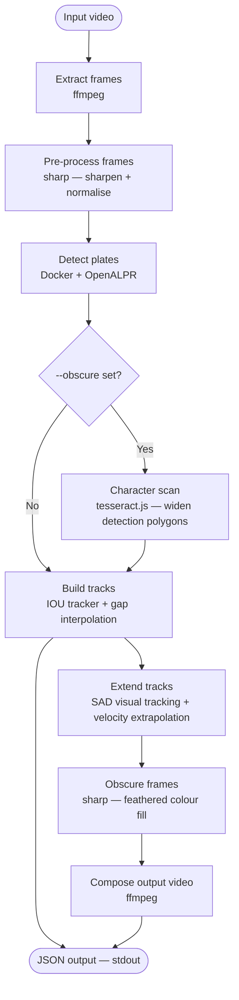

# number-jam

[](https://github.com/instantiator/number-jam/actions/workflows/main.yml)
[](https://github.com/instantiator/number-jam/actions/workflows/release.yml)
[](https://www.npmjs.com/package/number-jam)

Detects, tracks, and optionally obscures vehicle number plates in video clips.

## Overview

At the core of this project is [OpenALPR](https://github.com/openalpr/openalpr), which is used for numberplate detection.

> [!WARNING]
> OpenALPR is not maintained.

This project containerises OpenALPR, and supplements its findings with additional steps:

- Plates are initially found with OpenALPR
- Tesseract is used to identify nearby 'missed' characters and expand plate bounding boxes
- Short gaps between detections are interpolated
- SAD[^sad] is used to track motion of plates between, before, and after detections
- Falls back to velocity extrapolation



| Step               | What it does                                                                                                                                                                            |
| ------------------ | --------------------------------------------------------------------------------------------------------------------------------------------------------------------------------------- |
| **Extract frames** | Pulls every frame from the video as a JPEG using ffmpeg                                                                                                                                 |
| **Pre-process**    | Sharpens and normalises each frame; upscales if the source is narrower than 1280 px                                                                                                     |
| **Detect plates**  | Sends each frame to OpenALPR (running in Docker) and collects bounding-box polygons and plate text                                                                                      |
| **Character scan** | _(Obscuring only)_ Runs tesseract.js on an expanded region around each ANPR detection to find characters that OpenALPR clipped from the polygon edges; widens the polygon to cover them |
| **Build tracks**   | Links detections across frames using IOU matching; interpolates positions across short gaps                                                                                             |
| **Extend tracks**  | Extends each track beyond the ANPR detection window using SAD template matching (backward and forward), then velocity extrapolation for `--extend-detection` ms further                 |
| **Obscure frames** | Fills each detection polygon with a feathered colour sampled from the plate background                                                                                                  |
| **Compose video**  | Re-encodes the obscured frames into an output video with original audio                                                                                                                 |
| **JSON output**    | Writes a structured result document to stdout                                                                                                                                           |

[^sad]: **Sum of Absolute Differences.** This is a comparison between a block of pixels in the 'current' frame and a candidate block in a candidate frame. Using multiple candidate positions, the lowest SAD is the best match for the original block - so likely indicating the motion of the block.

## Usage

This tool can run under Linux or Mac OS. In both cases, Docker must be available.

### Setup

#### Mac OS

```bash
brew install --cask docker-desktop
npm install -g number-jam
docker build -t number-jam-alpr "$(npm root -g)/number-jam/docker/"
```

#### Linux (Ubuntu/Debian)

```bash
sudo apt-get install docker.io && sudo systemctl start docker
npm install -g number-jam
docker build -t number-jam-alpr "$(npm root -g)/number-jam/docker/"
```

The Docker image only needs rebuilding when number-jam is updated.

### Invocations

```bash
# Basic detection — print JSON to stdout
number-jam --input path/to/video.mp4

# Filter by region (comma-separated ISO codes)
number-jam --input video.mp4 --regions gb,de,fr

# Detect and obscure plates in an output video
number-jam --input video.mp4 --obscured-output output.mp4

# Extend obscured plates 5 seconds before/after each track
number-jam --input video.mp4 --obscured-output output.mp4 -x 5000

# Add padding and a 500 ms fade around each obscuring polygon
number-jam --input video.mp4 --obscured-output output.mp4 --padding-width 10px --padding-height 5% --fade-duration 500

# Include full frame-by-frame tracking history in JSON output
number-jam --input video.mp4 --verbose

# Pipe JSON output to a file
number-jam --input video.mp4 > results.json
```

Use `npx number-jam` in place of `number-jam` to run without a global install.

### Options

| Flag                              | Description                                                                      |
| --------------------------------- | -------------------------------------------------------------------------------- |
| `-i`, `--input <path>`            | Path to the input video file **(required)**                                      |
| `-o`, `--obscured-output <path>`  | Obscure detected plates and write the output video to this path                  |
| `-r`, `--regions <codes>`         | Comma-separated region codes (e.g. `gb,de,us`). Defaults to all.                 |
| `-v`, `--verbose`                 | Include full frame-by-frame polygon history in JSON output                       |
| `-c`, `--confidence <n>`          | Drop detections below this OCR confidence threshold (0–100)                      |
| `-x`, `--extend-detection <ms>`   | Extend obscuring this many milliseconds before/after each track (default: 2000)  |
| `-m`, `--min-fraction <n>`        | Minimum visible plate fraction (0–1) required to obscure a frame (default: 0.01) |
| `-f`, `--fade-duration <ms>`      | Fade obscuring polygons in/out over this many ms at each appearance (default: 1000) |
| `--padding-width <amount>`        | Expand each polygon horizontally on each side — e.g. `10`, `10px`, `5%`         |
| `--padding-height <amount>`       | Expand each polygon vertically on each side — e.g. `10`, `10px`, `5%`           |
| `-h`, `--help`                    | Show all options and list all accepted region codes                              |

### Region codes

Region codes follow ISO 3166-1 alpha-2 (e.g. `gb`, `de`, `fr`, `us`, `au`). Run the following to see every accepted code:

```bash
number-jam --help
```

## Output format

The tool prints a single JSON document to stdout:

```jsonc
{
  "request": {
    "path": "video.mp4", // input path as given
    "regions": ["gb", "de"], // region filter ("*" = all)
    "obscure": false,
    "verbose": false,
  },
  "summary": [
    {
      "plate": "AB12CDE",
      "region": "gb",
      "trackedFrom": 1040, // ms from video start
      "trackedUntil": 8320, // ms from video start
    },
    {
      "plate": "", // unreadable partial plate
      "region": null,
      "trackedFrom": 2500,
      "trackedUntil": 2500,
    },
  ],
  "tracking": [
    // populated only when --verbose is set
    {
      "plate": "AB12CDE",
      "history": [
        {
          "timestamp": 1040, // ms from video start
          "polygon": [
            [100, 200],
            [200, 200],
            [200, 250],
            [100, 250],
          ],
        },
        // ... one entry per frame the plate was visible
        // gaps between actual detections are interpolated
      ],
    },
  ],
  "videoDuration": 11000, // ms, rounded to nearest integer
  "processingDuration": 4521, // wall-clock ms
  "output": "/abs/path/out.mp4", // null when --obscure was not set
}
```

Progress information (frame count, detection counts, etc.) is written to **stderr** so that stdout can be cleanly piped to `jq` or a file.

---

## Dev notes

### Project structure

```
number-jam/
├── src/
│   ├── cli/         Phase functions, character scan, progress bars
│   ├── detection/   DetectionEngine interface, frame iterator, docker-alpr backend
│   ├── obscuring/   Feathered colour-fill obscurer
│   ├── output/      JSON output document builder
│   ├── regions/     Plate-format regex database and region inference
│   ├── tracking/    IOU tracker, motion helpers, SAD visual tracker
│   ├── video/       Frame extractor and video composer (ffmpeg)
│   ├── cli.ts       Entry point — orchestrates the full pipeline
│   └── types.ts     Shared TypeScript interfaces
├── docker/          Dockerfile and Flask HTTP wrapper for OpenALPR
├── scripts/         Install scripts, fixture downloader, plate-format generator
└── tests/
    ├── fixtures/    Static test fixtures (images, video clip, attribution)
    │   └── videos/  User-supplied plate-coverage clips (git-ignored)
    └── integration/ Integration tests and TestVideoMetadata type
```

### Running from source

Clone the repo, then use the provided launcher scripts to build and run without a global install:

```bash
docker build -t number-jam-alpr docker/

./run-mac.sh --input video.mp4    # macOS
./run-linux.sh --input video.mp4  # Linux
```

The scripts run `npm run build` if `dist/` is missing, then invoke `node dist/cli.js`.

### Running tests

```bash
# Unit tests (Docker not required)
npm test

# Unit tests with coverage report
npm run test:coverage

# Integration tests (requires Docker)
npm run test:integration
```

See `tests/fixtures/ATTRIBUTION.md` for licence details on the downloaded fixtures.

```bash
# Refresh fixtures
npm run download-fixtures
```

#### Unit test files

| File                              | What it tests                                                                      |
| --------------------------------- | ---------------------------------------------------------------------------------- |
| `tests/plate-formats.test.ts`     | Every regex in the plate-formats database — one passing + one failing example each |
| `tests/tracker.test.ts`           | IOU tracker logic (assignment, gap-filling, track closure)                         |
| `tests/motion.test.ts`            | Centroid, velocity, and polygon-shift helpers                                      |
| `tests/phases.test.ts`            | `velocityFromBackCoverage` helper                                                  |
| `tests/detection-engines.test.ts` | JSON parser fixtures for docker-alpr output format                                 |
| `tests/polygon-merge.test.ts`     | `mergeOverlappingPolygons` union-find algorithm                                    |
| `tests/visual-tracker.test.ts`    | SAD template-matching tracker on synthetic JPEG frames                             |
| `tests/character-scan.test.ts`    | Tesseract character scan on synthetic JPEG frames                                  |
| `tests/obscurer.test.ts`          | Plate obscuring geometry helpers and end-to-end                                    |
| `tests/infer-region.test.ts`      | Region inference utility (plate text → ISO region code)                            |
| `tests/formatter.test.ts`         | JSON output document builder                                                       |
| `tests/cli.test.ts`               | `parseRegions` and `warnUnknownRegions` helpers                                    |

#### Adding plate-coverage video fixtures

`tests/integration/plate-coverage.test.ts` discovers every `.mp4` in `tests/fixtures/videos/` and runs the full pipeline against it. The directory is git-ignored — add your own clips locally.

For each video, create a matching metadata file that tells the test what to expect:

1. **`tests/fixtures/videos/my-clip.mp4`** — the video clip (trim it to the window of interest)
2. **`tests/fixtures/videos/my-clip.metadata.json`** — describes what should be found and obscured...

```jsonc
{
  "expectations": [
    {
      // Canonical plate text. Matched case-insensitively.
      // A levenshtein distance ≤ 2 is tolerated (allows common misreads, eg. a dropped character).
      "plate": "AB12CDE",

      // Approximate number of seconds into the clip when the plate first / last appears.
      // When omitted, the test uses the earliest and latest frames in the detected track.
      "visibleFrom": 2,
      "visibleUntil": 9,

      // List the edges the plate enters / exits through.
      // Each listed edge enables a corresponding assertion (omit to skip those checks).
      "hasEntries": ["top"], // "left" | "right" | "top" | "bottom"
      "hasExits": ["bottom"],
    },
    // Add more objects here for additional plates in the same clip.
  ],
}
```

The tests that run per plate:

| Test                                                      | Condition                       |
| --------------------------------------------------------- | ------------------------------- |
| covers the plate without flicker or gaps                  | always                          |
| covers the plate during entry from `<edge>`               | `hasEntries` includes that edge |
| covers the plate during exit from `<edge>`                | `hasExits` includes that edge   |
| obscures the plate region without readable text remaining | always                          |

### Regenerating the plate-formats database

```bash
npm run generate-formats
```

This fetches several Wikipedia regional vehicle registration plate pages (Europe, Americas, Asia, Oceania, Africa) and appends any new region codes to `src/regions/plate-formats.ts`. Existing hand-curated entries are preserved. The generated file is checked in.

> [!NOTE]
> Newly appended entries are marked `TODO_NON_EXAMPLE` in their `nonExamples` field. Replace these with real failing examples and ensure `npm test` passes before committing.

### Publishing a release

Version numbers follow [semver](https://semver.org). The single source of truth is the `version` field in `package.json`.

```bash
npm version patch   # 0.1.0 → 0.1.1  (bug fixes)
npm version minor   # 0.1.0 → 0.2.0  (new features, backwards compatible)
npm version major   # 0.1.0 → 1.0.0  (breaking changes)
```

Each command bumps `package.json`, commits the change, and creates a matching git tag (e.g. `v0.2.0`). Push both the commit and the tag:

```bash
git push --follow-tags
```

This triggers the [Release workflow](.github/workflows/release.yml), which builds the package and publishes it to npm via OIDC trusted publishing. A GitHub Release is created automatically with generated release notes.

#### Verifying the release

1. Check the [Release workflow run](https://github.com/instantiator/number-jam/actions/workflows/release.yml) completed without errors
2. Confirm the new version appears on the [npm package page](https://www.npmjs.com/package/number-jam)
3. Smoke-test the published package: `npx number-jam@latest --help`
